# ScribeArabic User Manual

## Table of Contents

- [Terminology](#terminology)
- [Main Screen](#main-screen)
- [Button Descriptions](#button-descriptions)
- [Transcribe Text](#transcribe-text)
- [Annotation Process](#annotation-process)
  - [Draw an Annotation/Box](#draw-an-annotationbox)
  - [Move an Annotation/Box](#move-an-annotationbox)
  - [Edit an Annotation/Box](#edit-an-annotationbox)
  - [Delete an Annotation/Box](#delete-an-annotationbox)
- [Lens Options](#lens-options)
- [HTR Options](#htr-options)
- [Tagging an Annotation](#tagging-an-annotation)
---

## Terminology

<a href="../static/manual_images/terminology.png" target="_blank">
  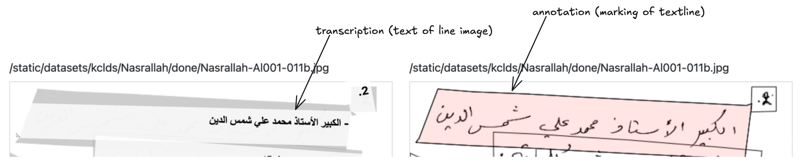
</a>

- An [**annotation**](../static/../static/manual_images/terminology.png) is a bounding polygon or box around a text line in the document image.
- The content/text of the line is called its [**transcription**](../static/manual_images/terminology.png).
- The shape of the polygon/box is determined by [**control points**](../static/manual_images/control_points.png).
- **HTR**: Handwritten Text Recognition.

<a href="../static/manual_images/control_points.png" target="_blank">
  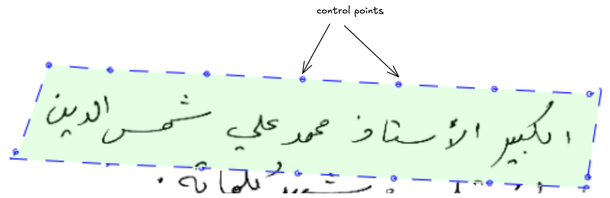
</a>

---

## Main Screen

<a href="../static/manual_images/screen.png" target="_blank">
  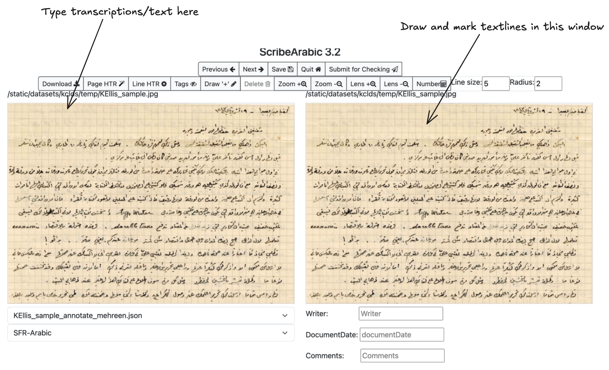
</a>

- The right window allows drawing, moving, editing, deleting, and tagging annotations.
- The left window is for transcribing text.

---

## Button Descriptions

- **Previous / Next**: Navigate between images. Saves current annotations and transcriptions.
- **Save**: Save current annotations and transcriptions.
- **Quit**: Exit the annotation tool.
- **Tags**: Toggle annotation tag visibility.
- **Draw**: Enter draw mode to create polygon annotations.
- **Zoom In/Out**: Zoom image in or out.
- **Lens**: Show a magnified view of the cursor area.
- **Number**: Convert transcribed numbers to Arabic numerals.
- **Line Size**: Adjust line thickness when drawing/editing.
- **Radius**: Adjust control point size when drawing/editing.
- **Page HTR**: OCR the entire page (also detects text lines if SFR is used).
- **Line HTR**: OCR selected line or all annotated lines.

---

## Transcribe Text

<a href="../static/manual_images/transcribe.png" target="_blank">
  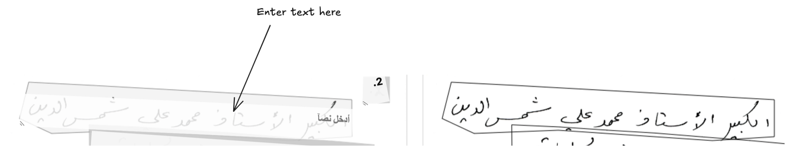
</a>

- Enter transcription in the left window for the highlighted line.

---

## Draw an Annotation/Box

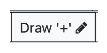

<a href="../static/manual_images/draw_example.png" target="_blank">
  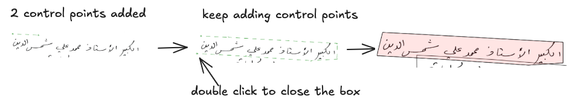
</a>

- Click **Draw** to enter draw mode.
- Left-click in the right window to add control points.
- Double-click to complete and close the shape.

---

## Move an Annotation/Box

- Single-click an annotation to enter move mode.
- Drag it to a new position.

---

## Edit an Annotation/Box

<a href="../static/manual_images/edit_example.png" target="_blank">
  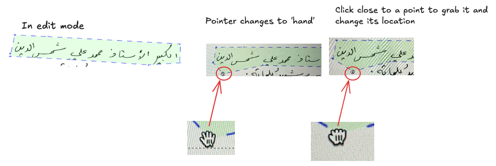
</a>

- Double-click inside an annotation to enter edit mode.
- Control points appear; cursor changes to hand.
- Drag points to adjust shape.
- Press `-` to delete a control point, `p` to add one.

---

## Delete an Annotation/Box

- Select a shape and press `Delete` or `Backspace` on your keyboard.

---

## Lens Options

<a href="../static/manual_images/lens.png" target="_blank">
  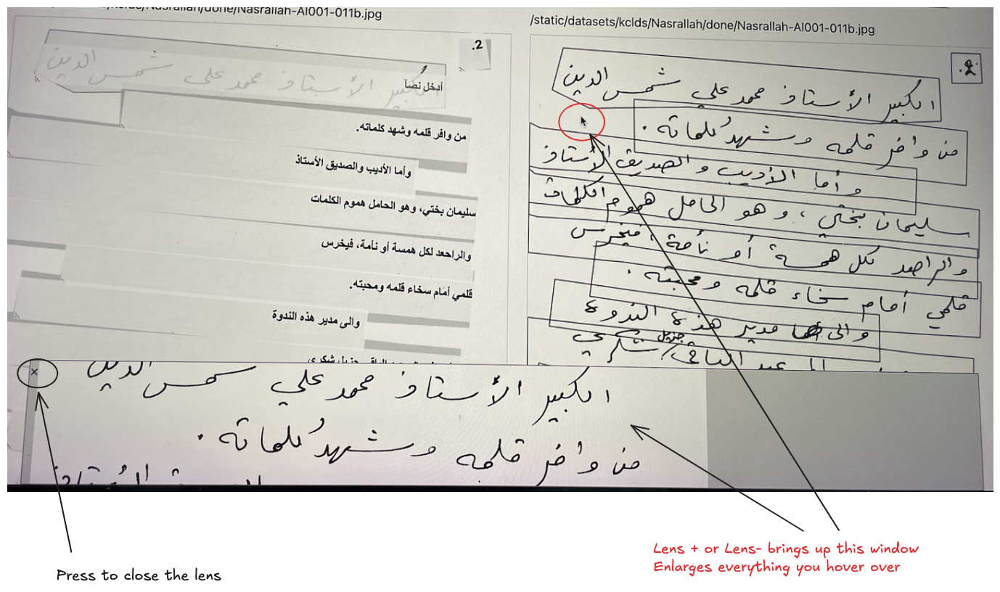
</a>

- Lens+ and Lens- adjust zoom on a hover-based lens view.
- Close the lens by clicking the 'x' on the lens window.
- The typing area is not zoomed unless the cursor moves outside it.

---

## HTR Options

<a href="../static/manual_images/htr.png" target="_blank">
  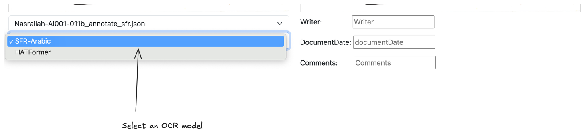
</a>

- Choose an HTR model from the bottom of the screen:
  - **SFR-Arabic**: Detects and transcribes text lines.
  - **HATFormer**: Transcribes text only (for annotated lines).
- **Page HTR**: Annotates and transcribes all lines.
- **Line HTR**: Transcribes selected line or all annotated lines (no annotation changes).
- **Note**: Running HTR may overwrite changes.
- If slow, switch to another image and return later.

<a href="../static/manual_images/htr_detail.png" target="_blank">
  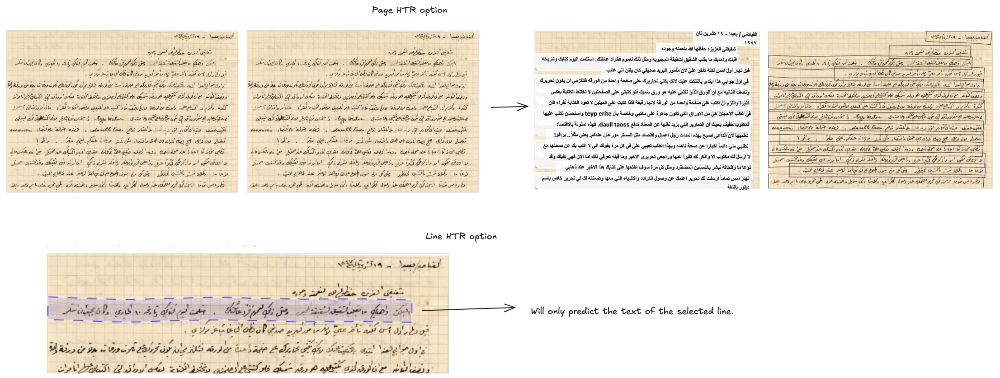
</a>

---

## Tagging an Annotation

<a href="../static/manual_images/tag.png" target="_blank">
  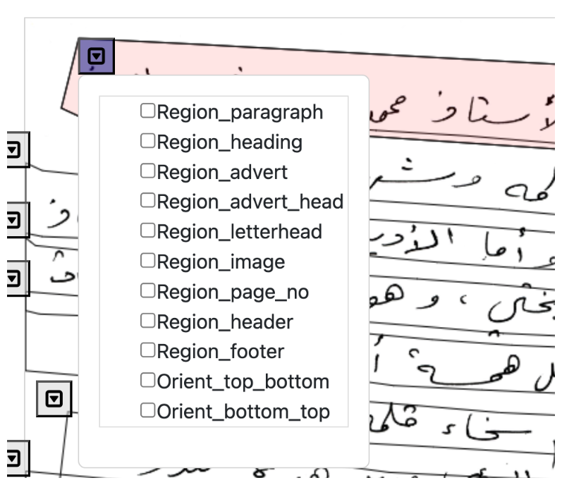
</a>

- Tags describe annotation content (e.g., heading, page number).
- Click the top-left box of an annotation to assign a tag like `Region_heading` or `Region_floating`.
- Tag list is configurable (admin only).

---
